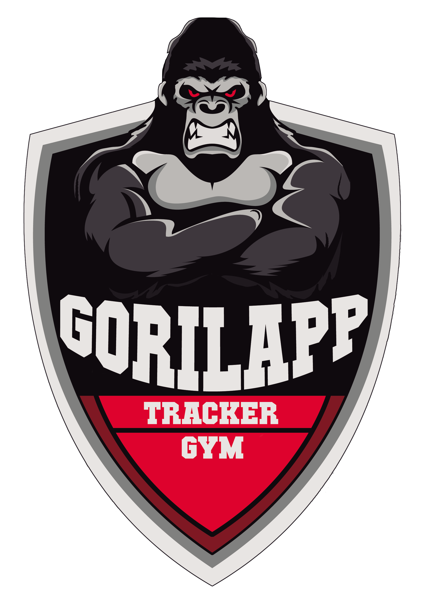

# GorilApp 🦍

> **Tu Gymbro de Entrenamiento.**

Aplicación PWA diseñada para registrar tus entrenamientos de fuerza de forma rápida, intuitiva y con una estética agresiva que te motiva a darlo todo.

## 📜 Historial de Cambios

### v1.2.1 - ui Improvements 🎨
- **Timers MM:SS**: Formato de tiempo optimizado (4 dígitos) para mejor visualización horizontal.
- **Interfaz Refinada**: Mejoras visuales en modales, inputs y botones de acción.
- **Perfil Actualizado**: Créditos y lista completa de características.
- **Hotfix**: Solución a problemas de arranque.

### v1.2.0 - Gestión Total & Timers Pro 🏋️‍♂️
- **CRUD de Ejercicios**: Añade, edita y elimina ejercicios de tus rutinas al instante.
- **Suite de Timers**: Nuevos modos Tabata, EMOM, AMRAP, For Time y Clock.
- **Estética LED**: Visualización estilo marcador deportivo (7 segmentos).
- **UX**: Cuenta atrás inicial cancelable y sonidos de alerta.
- **Responsive**: Diseño ajustado para evitar scroll en móviles.

### v1.0.0 - Lanzamiento Inicial 🚀
- 📊 **Registro Local**: Base de datos DexieDB privada y offline.
- 📱 **PWA**: Instalable y funcional sin internet.
- 📈 **Progreso**: Historial de sesiones y gráficas de evolución.
- 📋 **Rutinas Base**: Plan PPL (Empuje, Tirón, Pierna) incluido.

## 🛠️ Tecnologías
- React 19 + Vite
- Dexie.js (IndexedDB wrapper)
- Recharts (Gráficas de progreso)
- Lucide React (Iconos)

---
*GorilApp - Entrena como una bestia.*
